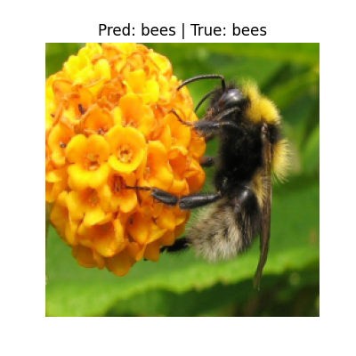

# Vision Transformer (ViT) - Hymenoptera Classification

This project fine-tunes a **Vision Transformer (ViT-B/16)** model for classifying images into two classes: **ants** and **bees** using the *hymenoptera dataset*.  

---

## What is ViT?

ViT stands for **Vision Transformer**, a deep learning model that applies the Transformer architecture (originally from NLP) directly to image patches instead of words.
- An image is split into small fixed-size patches
- Each patch is flattened and passed as a sequence to a standard Transformer Encoder
- Outperforms CNNs on large datasets when trained properly

Paper: ["An Image is Worth 16x16 Words"](https://arxiv.org/abs/2010.11929)

---

## Requirements
Install required libraries 

```bash
pip install -r requirements.txt
```

## How to Run

Clone the repository, install the dependencies, download the pretrained weights, set up the dataset, and run the training script.

```bash
git clone https://github.com/serasr/Vision-Transformer-for-Image-Classification.git

cd Vision-Transformer-for-Image-Classification/

bash scripts/setup_env.sh

# (Prepare the hymenoptera_data folder structure with ants/ and bees/ inside train/ and val/ folders)

python scripts/train.py

# Optional
python scripts/save_predictions.py 

```
### Example Predictions
<p align="center">
  
  
  
  
</p>

## Contributor

Individual work by author

## Data Source

Kaggle

## Acknowledgements

Adapted the base Vision Transformer code from the open-source repository:
 jeonsworld/ViT-pytorch

